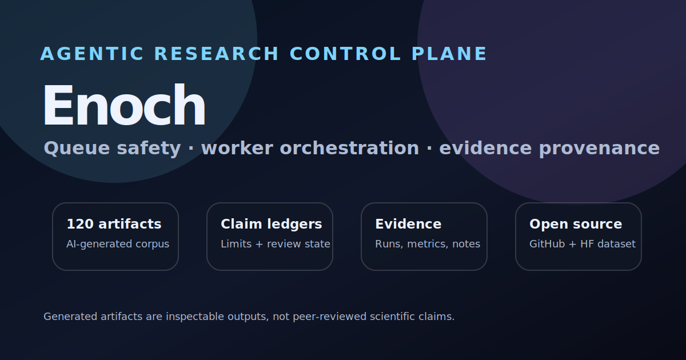

# Enoch Agentic Research System



Enoch is a reliability-focused control plane for autonomous AI research work. It turns a scored research idea into a supervised agent run, watches the real worker state, preserves evidence, and produces bounded, auditable AI-generated research artifacts.

The project is built around a simple operational belief:

> Agentic AI systems need control planes. A model can propose and execute work, but a separate system should decide what is queued, what is safe to dispatch, whether work is actually done, and what evidence supports the final artifact.

## What Enoch does

Enoch coordinates the full research loop:

```text
LLM research scout
  -> structured idea cards
  -> Notion scoring / weight matrix
  -> queue candidate
  -> VM control plane
  -> worker preflight and dispatch safety checks
  -> GB10 worker wake gate
  -> agent run with process + telemetry supervision
  -> evidence sync
  -> AI-generated research artifact
  -> corpus quality gates
```

The current repository contains the execution/control-plane layer and supporting docs. Historical notes describe earlier migration experiments, but this is not a workflow-export repository and does not ship workflow-tool configurations.

## Why this matters

Long-running autonomous AI work fails in ways ordinary scripts do not:

- child processes continue after an agent session appears idle;
- GPU workers can still be active when queue state says no work is running;
- queues can become stale or disagree across sources;
- evidence is scattered across machines and run folders;
- generated reports can overstate results unless claim boundaries are preserved.

Enoch treats those as control-plane problems. It uses process tracking, CPU/GPU quiet-window telemetry, idempotent APIs, stale-state reconciliation, dashboard status, evidence bundles, and claim ledgers to make autonomous work observable and auditable.

## Main components

- **Control plane API** — FastAPI and LangGraph-era queue state, project state, paper review state, pause/maintenance controls, dispatch decisions, and dashboard APIs.
- **Wake gate** — process-tree tracking and telemetry quiet-window checks before a run is considered complete.
- **Worker preflight** — authenticated checks against a worker before dispatching new work.
- **Single-lane safety** — prevents overlapping GPU-heavy work on constrained local hardware.
- **Evidence sync** — copies run notes, metrics, result summaries, evidence bundles, and claim ledgers from worker projects into the control plane.
- **Artifact writer** — generates publication-style Markdown reports from evidence context while preserving uncertainty and provenance.
- **Quality gates** — scans generated reports for placeholder citations, missing provenance, and missing evidence artifacts.


## Runtime and upstream tooling

Enoch is the project-specific control plane and release package. It runs agent work through Codex/OMX automation, including [oh-my-codex](https://github.com/Yeachan-Heo/oh-my-codex) orchestration for local agent execution, while the control-plane state model is built around FastAPI and LangGraph-era graph boundaries. OMX is part of the operating substrate; generated research artifacts are produced by Enoch runs and the artifact writer, not by OMX as an owning publisher.

## Idea intake

Ideas came from an upstream LLM-assisted scouting process that reviewed technical signals such as AI news, public research papers, systems discussions, and local hardware/runtime opportunities. Candidate ideas were framed as structured experiment cards, scored in a Notion weight matrix, and then handed to Enoch as queue candidates.

Notion is best understood as an intake and prioritization surface. Runtime authority begins in the Enoch control plane.

See [`docs/idea-intake-workflow.md`](docs/idea-intake-workflow.md).

## Workflow documentation

- [`docs/quickstart.md`](docs/quickstart.md) — local clone-to-dashboard smoke test.
- [`docs/system-workflow.md`](docs/system-workflow.md) — current architecture and control-plane boundaries.
- [`docs/idea-intake-workflow.md`](docs/idea-intake-workflow.md) — LLM scouting, Notion scoring, and queue handoff.
- [`docs/release/authorship-and-provenance.md`](docs/release/authorship-and-provenance.md) — how generated reports should be framed.
- [`docs/historical/`](docs/historical/) — historical migration notes retained for engineering context only.
- [`docs/launch-checklist.md`](docs/launch-checklist.md) — public launch checklist.
- [`site/`](site/) — static launch site for explaining Enoch and highlighting selected generated artifacts.
- [`docs/featured-paper-selection.md`](docs/featured-paper-selection.md) — rationale for the launch highlight set.
- [`docs/outreach/launch-announcement.md`](docs/outreach/launch-announcement.md) — draft launch copy and repo descriptions.
- [`docs/launch-todo.md`](docs/launch-todo.md) — launch TODO and remaining public-release gates.

## Authorship and generated research artifacts

Generated reports are not presented as human-authored or peer-reviewed papers. They are AI-generated research artifacts created from run notes, evidence bundles, claim ledgers, and reproducibility traces.

Recommended framing:

> The reports produced by this system are AI-generated research artifacts. The maintainer releases the corpus for inspection and critique but does not claim personal authorship of the generated papers, arguments, or prose.


## Quickstart

Start with [`docs/quickstart.md`](docs/quickstart.md) for a local developer smoke test.

## Deployment

Start with [`docs/deployment-guide.md`](docs/deployment-guide.md). It covers the control VM, worker machine, systemd service, dashboard/API smoke tests, optional Pushover alerts, dispatch checks, and paper-writer settings.

For individual config fields, see [`docs/configuration-reference.md`](docs/configuration-reference.md).

## Development

```bash
uv run pytest -q
```

## Configuration

Start from `config.example.json` or `deploy/omx-wake-gate.json.example` and provide local values for:

- inbound API bearer token;
- completion callback URL/token;
- project root;
- dispatch script path;
- worker URL/token;
- optional notification and paper-writer provider settings.

Never commit live config files or credentials.

## Security

Before publishing or deploying changes, run secret scans and tests. See [`SECURITY.md`](SECURITY.md).

## License

Apache License 2.0. See [`LICENSE`](LICENSE).
