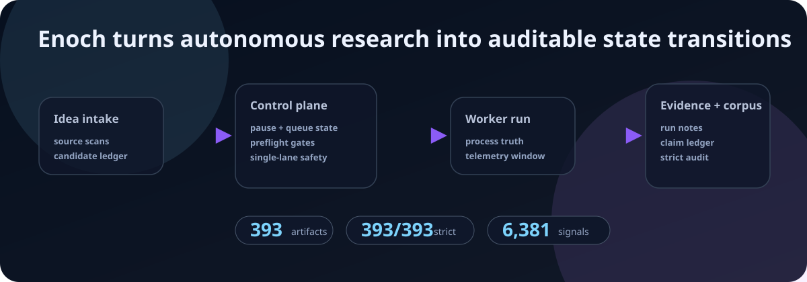

# Enoch Agentic Research System


**Enoch is a control plane for bounded autonomous AI research.** It turns idea intake, worker execution, evidence capture, generated reports, and public release gates into explicit state transitions instead of trusting that a model session "probably finished."

<p>
  <a href="https://solo-09d10f60.mintlify.app/"><strong>Docs</strong></a> ·
  <a href="https://alias8818.github.io/enoch-agentic-research-system/"><strong>Launch site</strong></a> ·
  <a href="https://github.com/alias8818/enoch-ai-research-corpus"><strong>Research corpus</strong></a> ·
  <a href="https://github.com/alias8818/enoch-promising-signals"><strong>Promising signals</strong></a>
</p>



## Current public release posture

| Surface | Current public fact |
| --- | --- |
| Runtime | `1.41.94` |
| Corpus artifacts | `393` AI-generated research artifacts |
| Packaging/provenance gate | `393/393` pass |
| Strict claim/evidence audit | `393/393` pass |
| Promising signals | `6,381` bounded no-paper signals |

Those counts are public-release facts, not scientific-validity claims. Enoch makes the difference visible: operational health, signal preservation, paper-corpus readiness, and public trust posture are separate claims.

## Why this exists

Long-running autonomous AI work fails in ways ordinary scripts do not:

- child processes can continue after an agent session appears idle;
- worker telemetry can disagree with queue state;
- stale rows and optimistic dashboards can hide blocked work;
- evidence scatters across machines and run folders;
- generated reports can overstate results when claim boundaries are not preserved.

Enoch treats those as **control-plane problems**. The system keeps queue state, worker truth, pause/maintenance controls, evidence sync, artifact generation, and release gates outside the model conversation.

## What is in this repository

- **FastAPI control plane** for queue state, project state, publication automation, pause/maintenance controls, and dispatch decisions.
- **Worker gate and preflight checks** for process-tree truth, telemetry quiet windows, and safe dispatch boundaries. Older code/config may still say `wake_gate`; treat that as compatibility naming.
- **Research Facility ledgers** for source scanning, candidate generation, dedupe/history comparison, novelty/feasibility scoring, and admission decisions.
- **Dashboard V2** for operator-facing readiness, queues, runs, papers, and evidence-gate state.
- **Evidence sync and artifact writer** for run notes, metrics, result summaries, evidence bundles, claim ledgers, and generated reports.
- **Release validators** for packaging/provenance, strict claim/evidence auditability, public counts, and generated public surfaces.

## System shape

```text
Research Facility source scan
  -> generated research candidates
  -> dedupe / score / admission ledger
  -> control-plane ideas workbench
  -> queue candidate
  -> control-plane dispatch gates
  -> worker preflight + worker gate
  -> agent run with process/telemetry supervision
  -> evidence sync
  -> AI-generated research artifact
  -> packaging/provenance + strict claim/evidence gates
  -> public corpus or promising-signal lane
```

For current runtime, storage, worker, decision-artifact, automation, and compatibility boundaries, see [`docs/current-runtime-snapshot.md`](docs/current-runtime-snapshot.md).

## Public outputs

- [`alias8818/enoch-ai-research-corpus`](https://github.com/alias8818/enoch-ai-research-corpus) contains generated research artifacts, evidence bundles, claim ledgers, manifests, and audit reports.
- [`alias8818/enoch-promising-signals`](https://github.com/alias8818/enoch-promising-signals) preserves bounded useful or compute-scale-blocked no-paper results. These are not papers and not peer-reviewed results.
- [`aliasocracy/enoch-ai-research-corpus`](https://huggingface.co/datasets/aliasocracy/enoch-ai-research-corpus) mirrors the public corpus dataset and promising-signal split.

The reports produced by Enoch runs are **AI-generated research artifacts**, not human-authored or peer-reviewed papers. The maintainer releases the corpus for inspection and critique but does not claim personal authorship of the generated papers, arguments, or prose.

## Getting started

For a local developer smoke test, start with [`docs/quickstart.md`](docs/quickstart.md).

For a full deployment path, see [`docs/deployment-guide.md`](docs/deployment-guide.md). For individual config fields, start from `config.example.json` and [`docs/configuration-reference.md`](docs/configuration-reference.md).

Never commit live config files or credentials.

## Development

```bash
uv run pytest -q
python scripts/validate_versioning.py
python3 scripts/validate_runtime_snapshot_links.py
python3 scripts/validate_runtime_deploy.py --source . --runtime /opt/enoch-control-plane --expected-commit HEAD --summary-only
```

## Documentation map

- [Hosted Enoch Docs](https://solo-09d10f60.mintlify.app/) — operator and reviewer documentation ([source](https://github.com/alias8818/enoch-docs))
- [`docs/operator-runbook.md`](docs/operator-runbook.md) — long-haul readiness, pause/resume, callbacks, and paper-gate checks
- [`docs/research-facility.md`](docs/research-facility.md) — source/candidate/admission/lineage ledgers
- [`docs/release/authorship-and-provenance.md`](docs/release/authorship-and-provenance.md) — generated-artifact framing
- [`CHANGELOG.md`](CHANGELOG.md) — runtime version history and compatibility notes

## Security

Before publishing or deploying changes, run secret scans and tests. See [`SECURITY.md`](SECURITY.md). Public docs and images must not expose private hostnames, internal paths, tokens, live operator state, or stale count anchors.

## License

Apache License 2.0. See [`LICENSE`](LICENSE).
