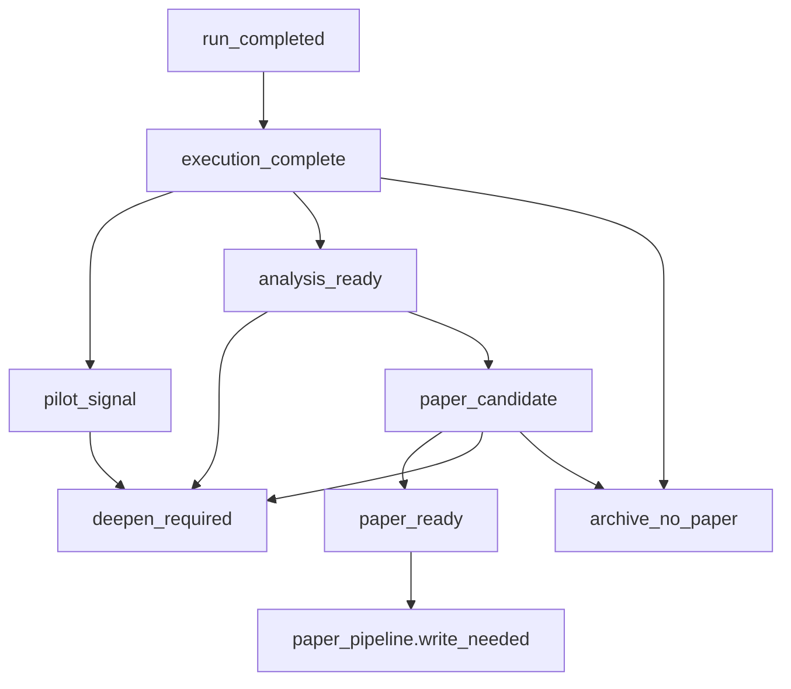

# Enoch state transition map

Status: active operator contract as of 2026-05-07.

This is the grade-school lifecycle map for ideas, projects, runs, papers, publication, and corpus import. It is intentionally smaller than the raw database vocabulary. Raw states remain compatibility/detail evidence; operator lanes answer what a human or agent should do next.
For current runtime topology and decision-artifact ownership, see
[`current-runtime-snapshot.md`](current-runtime-snapshot.md).

```text
Idea -> Queue -> Run -> Decision -> [Follow-up Investigation] or Paper -> Publication -> Corpus
```

## Paper readiness decision tree

Paper readiness is a separate contract from queue/run lifecycle and the compact
decision gate. The raw lifecycle still says whether work is queued, running, or
completed. The decision gate still uses `missing`, `malformed`, `unknown`,
`needs_review`, `negative`, and `positive`. Evidence maturity answers the paper
question: why is there no paper, and what deterministic evidence is missing?



### Evidence maturity

| Maturity state | Meaning | Operator lane |
| --- | --- | --- |
| `execution_complete` | Run finished, but no complete decision/evidence packet exists. | `complete_no_paper` |
| `pilot_signal` | Bounded or proxy-only useful signal; preserve it outside paper writing. | `useful_signal` |
| `analysis_ready` | Artifacts are sufficient for review/scoring, not paper-ready. | `complete_no_paper` |
| `deepen_required` | Promising signal with a concrete missing-evidence list. | `followup_investigation` |
| `paper_candidate` | Minimum paper evidence exists, pending claim/novelty audit. | `complete_no_paper` |
| `paper_ready` | Hard gate, claim ledger, and score floors all pass. | `write_paper` |
| `archive_no_paper` | No useful follow-up remains or the result is intentionally closed. | `complete_no_paper` |

### Claim readiness gate

Only `paper_ready` enters `paper_pipeline.write_needed`. A v2
`project_decision.json` must satisfy every hard gate before the run can become
paper work:

- hypothesis declared
- baseline or comparator present
- metric/result table present
- success threshold declared
- artifact manifest present
- claim ledger present
- failure cases present
- reproduction command or bounded replay instructions present
- related-work/novelty check present
- claim scope and scale limits present
- no unresolved contradiction for central claims

Claim-ledger verdicts are deterministic. `supported` claims may be used in the
paper. `partial` claims may only appear as limitations or future-work language.
`unsupported`, `contradicted`, and `missing_evidence` block central paper
claims. The conservative score floors are total >= 78/100, evidence directness
>= 4/5, claim support >= 4/5, reproducibility >= 4/5, limitations honesty
>= 4/5, baseline strength >= 3/5, and related-work positioning >= 3/5.

| From -> To | Deterministic condition |
| --- | --- |
| `run_completed` -> `execution_complete` | Run finished before a complete decision/evidence packet exists. |
| `execution_complete` -> `pilot_signal` | Decision artifact reports bounded or proxy-only useful signal. |
| `execution_complete` -> `analysis_ready` | Artifacts are sufficient for review/scoring but not paper evidence. |
| `execution_complete` -> `archive_no_paper` | Negative result has no useful follow-up signal. |
| `pilot_signal` -> `deepen_required` | Useful signal names concrete missing evidence. |
| `analysis_ready` -> `deepen_required` | Review identifies a concrete evidence gap. |
| `analysis_ready` -> `paper_candidate` | Minimum paper evidence exists and claim audit can run. |
| `paper_candidate` -> `paper_ready` | Hard gate, central claim ledger, and score floors pass. |
| `paper_candidate` -> `deepen_required` | Claim audit or scorecard identifies concrete missing evidence. |
| `paper_candidate` -> `archive_no_paper` | Central claim is unsupported or contradicted with no bounded follow-up. |

The Research Yield dashboard panel reports latest paper age, count by maturity
state, the top `deepen_required` candidate, and the dominant missing-evidence
reason. A paper drought is a visibility warning, not an operational-readiness
blocker; "Can I leave this running?" remains owned by automation readiness.

## Transition table

| Step | From -> To | Source of truth | Writer/owner | Validation gate | Invalid/impossible transition | Operator lane shown |
| --- | --- | --- | --- | --- | --- | --- |
| 1 | Idea -> Queue | `ideas` and `queue_items` in the control-plane store | Control-plane idea importer / queue projection | Queue row has stable `project_id`, title, priority, machine/model/sandbox policy | Notion/source metadata overwriting control-plane-owned runtime fields | `ready_queue` or `paused` |
| 2 | Queue -> Run | `queue_items.current_run_id`, `runs` | Control-plane dispatch path | Queue is not paused, worker preflight passes, dispatch writes a run id | Dispatch while maintenance/paused or without fresh worker evidence | `running` |
| 3 | Run -> Decision | `runs`, project-local `.enoch/project_decision.json` or legacy `.omx/project_decision.json`, `project_decisions` | Worker callback reconciliation | Wake/callback delivery is recorded and decision artifact is parsed/synced | Treating `wake_ready`, `completed`, or `session_finished_ready` as positive by itself | `complete_no_paper` until a positive decision gate exists |
| 4 | Decision -> Follow-up Investigation | `project_decisions.followup_*`, controller source lineage depth, and follow-up launch events | Explicit bounded follow-up launch | Parent is no-paper; decision artifact recommends a concrete adjacent test; effective depth is below `max_followup_depth`; no prior `followup.launch` event exists for the parent | Treating follow-up metadata as paper-positive, relaunching the same parent, resetting lineage depth, or auto-chaining indefinitely | `followup_investigation` / `Investigate Next` |
| 5 | Decision -> Paper | `project_decisions.decision_gate_state`, v2 paper-readiness fields, and paper ledger absence | Explicit bounded paper drafting | Decision gate is compatible and evidence maturity is `paper_ready`; no live paper row exists for the project/run | Negative, missing, malformed, unknown, ambiguous, follow-up-only, proxy-only, `paper_candidate`, or already-papered work becoming writable | `write_paper` only when `paper_ready` |
| 6 | Paper -> Publication | `papers.paper_status`, `publication_automation_items` | Publication automation / finalizer | Draft exists and automation produces a finalization package | Human approval/review vocabulary as the normal path | `automate_publication` |
| 7 | Publication -> Corpus | Required evidence paths plus `publication_automation_items.finalized` and `corpus_imports` ledger | Corpus import script and public release validator | Publication draft has required evidence paths and finalized package; public corpus index includes sanitized artifact by source fingerprint; control-plane ledger records the import | Counting all finalized rows as actionable publish/import work | `ready_to_publish` only while missing corpus import, then `published`/public corpus evidence |
| 8 | Corpus -> Public release/HF | `papers/index.json`, `quality/*`, `site/ecosystem.json`, HF `dataset_summary.json` | Public release bundle push and HF export | Generated manifest and public release validation pass; HF JSONL row count matches | Hand-edited public counts or stale GitHub/HF metadata | Public/corpus count, not active operator work |

## Hard invariants

1. `write_paper` requires a positive-compatible project decision gate, `paper_ready` evidence maturity for v2 artifacts, and no existing live paper row. Legacy local decisions reach the compatibility gate through exact `finalize_positive` only.
2. Positive-ish near-synonyms such as `partial_viable`, `promising_synthetic_positive`, `promising_continue`, `viable`, or `proceed` are not writable decisions.
3. `complete_no_paper` is the correct operator lane for negative, missing, malformed, unknown, or ambiguous decisions.
4. `wake_ready` and `session_finished_ready` mean worker delivery, not outcome polarity.
5. A follow-up recommendation is no-paper adjacent-investigation work; it does not make the parent run writable.
6. Follow-up chains are explicitly bounded; default cap is depth 4 for bounded research-campaign follow-ups.
7. `publication_draft` alone is not public; corpus import is separate from finalization.
8. `paper_pipeline.raw_completed_no_paper_candidates` is informational only; it must equal `write_needed + not_writable_by_decision_gate`.
9. Dashboard `operator_counts` may contain canonical operator lanes and aggregate keys only; detail stages belong in `operator_detail_counts` or debug drill-downs.
10. Public counts come from `papers/index.json` through `generate_ecosystem_manifest.py` and `validate_public_release.py`, then the Hugging Face export must match the same count.

## Operator question mapping

| Operator question | Trust this field/surface | Do not substitute |
| --- | --- | --- |
| What needs me? | `operator_counts.needs_attention` and `needs_operator` rows | Raw `needs_review` strings |
| What is running? | `counts.active`, `operator_counts.running`, active rows | Stale historical `runs.state` values |
| What can be written? | `paper_pipeline.write_needed` | Raw completed/no-paper candidates |
| What needs another investigation? | `investigation_pipeline.followup_needed` | Negative/no-paper rows without concrete follow-up metadata |
| What can be finalized? | `paper_pipeline.finalize_needed` | Draft row existence alone |
| What can be published/imported? | `paper_pipeline.publish_ready` / `missing_from_corpus` | `publication_draft` count or all finalized rows |
| What is already public? | `paper_pipeline.published_imported`, `corpus_imports`, public corpus `papers/index.json`, `site/ecosystem.json`, HF `dataset_summary.json` | Control-plane paper row count |

## Validation commands

```bash
uv run pytest -q tests/test_state_transition_map.py tests/test_control_plane_operator_status.py tests/test_state_doctor.py
uv run python scripts/state_doctor.py --database-url "$ENOCH_CONTROL_DATABASE_URL" --control-url "$ENOCH_CONTROL_URL" --token-file /path/to/token --corpus ../enoch-ai-research-corpus
python3 scripts/generate_ecosystem_manifest.py --corpus ../enoch-ai-research-corpus --docs ../enoch-docs --output /tmp/enoch-ecosystem.generated.json
python3 scripts/sync_corpus_import_ledger.py --corpus ../enoch-ai-research-corpus --sql-output /tmp/enoch-sync-corpus-imports.sql
python3 scripts/validate_public_release.py --system . --corpus ../enoch-ai-research-corpus --docs ../enoch-docs --profile ../alias8818.github.io --owner-profile ../alias8818 --generated-manifest /tmp/enoch-ecosystem.generated.json
```
